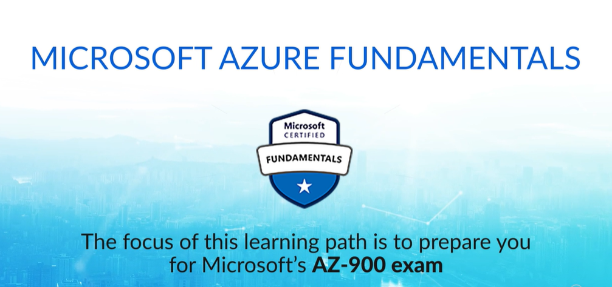
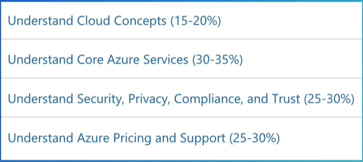
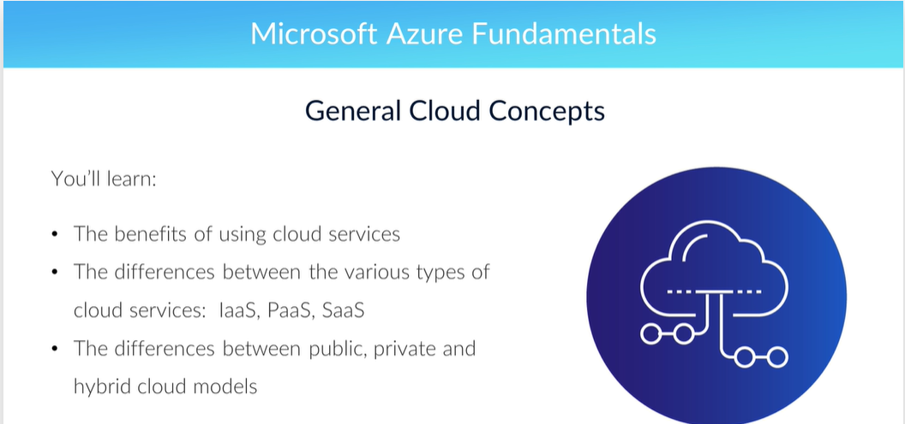
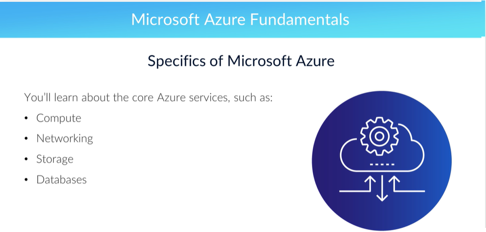
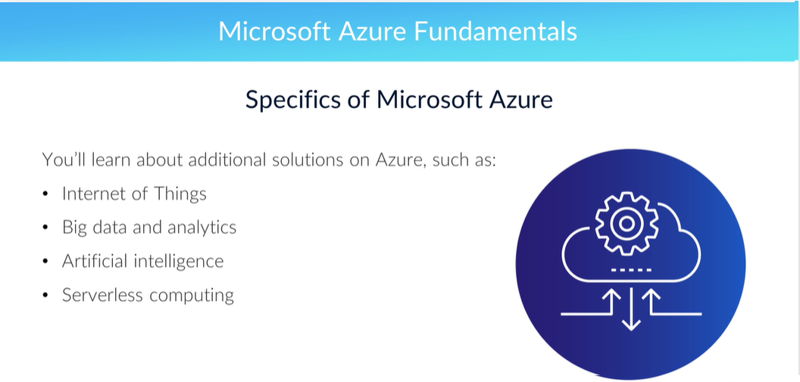
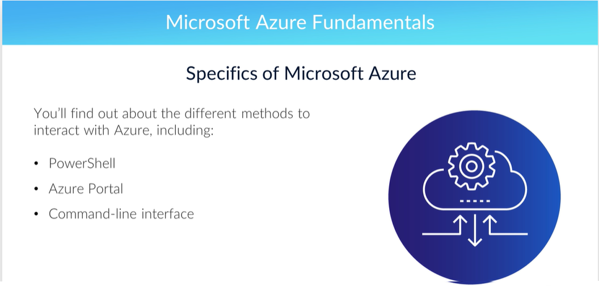
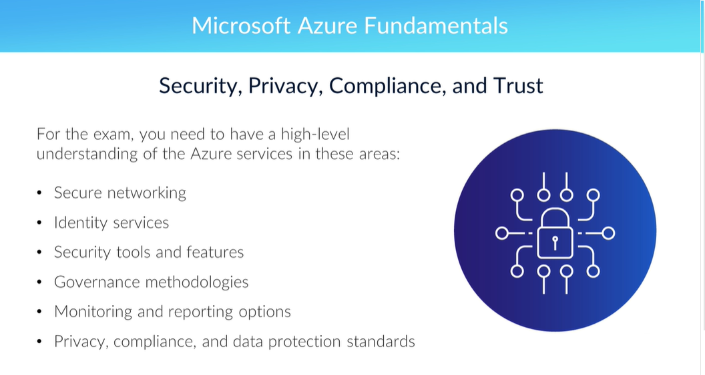
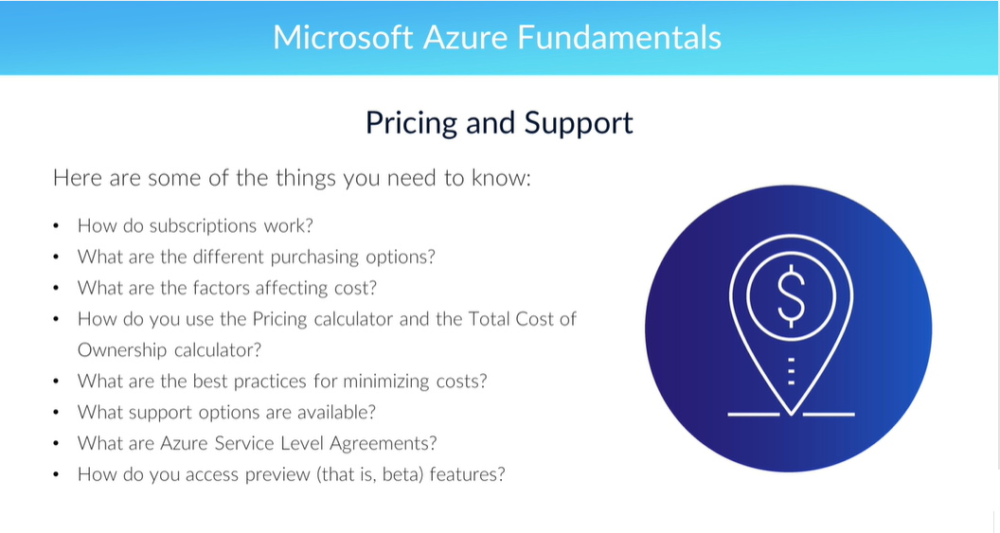

# AZ-900 Подготовка к экзамену: основы Microsoft Azure

## Подготовка к экзамену AZ-900 — Введение

Здравствуйте и добро пожаловать в Microsoft Azure Fundamentals. Целью этого пути обучения является подготовка к экзамену Microsoft AZ-900. Если вы сдадите экзамен AZ-900, вы получите сертификат Microsoft Certified Azure Fundamentals.

Экзамен AZ-900 проверяет ваши знания по четырем предметным областям. Вот как мы рассмотрим их на этом пути обучения

Мы начнем с рассмотрения общих концепций облачных вычислений, поэтому вам не нужно иметь какой-либо предыдущий опыт работы с облачными средами. 

Во-первых, вы узнаете о преимуществах использования облачных сервисов, таких как масштабируемость и эластичность. Мы объясним различия между различными типами облачных сервисов, такими как «инфраструктура как услуга», «платформа как услуга» и «программное обеспечение как услуга». 

Вы также узнаете о различиях между публичными, частными и гибридными облачными моделями.

Познакомив вас с общими концепциями облачных вычислений, мы углубимся в особенности Microsoft Azure, начиная с основных служб Azure, включая вычисления, сети, хранилище и базы данных. 

Мы также предоставим вам обзор широкого спектра решений, доступных в Azure, таких как Интернет вещей, большие данные и аналитика, искусственный интеллект и бессерверные вычисления. Затем вы узнаете о различных методах взаимодействия с Azure, включая PowerShell, портал Azure и интерфейс командной строки.

Третий раздел посвящен безопасности, конфиденциальности, соответствию требованиям и доверию. Microsoft очень сильна в этой области, так что есть что охватить. Для сдачи экзамена вам необходимо иметь общее представление о службах Azure в следующих областях:

- Безопасная сеть
- Службы идентификации — здесь основное внимание уделяется Azure Active Directory.
- Инструменты и функции безопасности, такие как Security Center и Key Vault
- Методологии управления, такие как управление доступом на основе ролей
- Возможности мониторинга и отчетности, а также
- Стандарты конфиденциальности, соответствия и защиты данных

Последний раздел посвящен ценам и поддержке. Может показаться немного удивительным, что на эту тему есть целый раздел, но для экзамена вам нужно знать довольно много высокоуровневых деталей. Вот некоторые вещи, которые вам нужно знать:

- Как работают подписки?
- Какие существуют варианты покупки?
- Какие факторы влияют на стоимость?
- Как вы используете калькулятор ценообразования и калькулятор совокупной стоимости владения?
- Каковы наилучшие методы минимизации затрат?
- Какие варианты поддержки доступны?
- Что такое соглашения об уровне обслуживания Azure?
- И как получить доступ к предварительным (то есть бета-) функциям?

