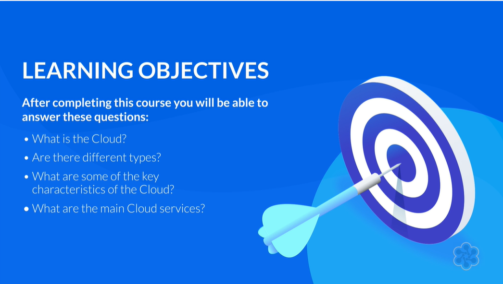
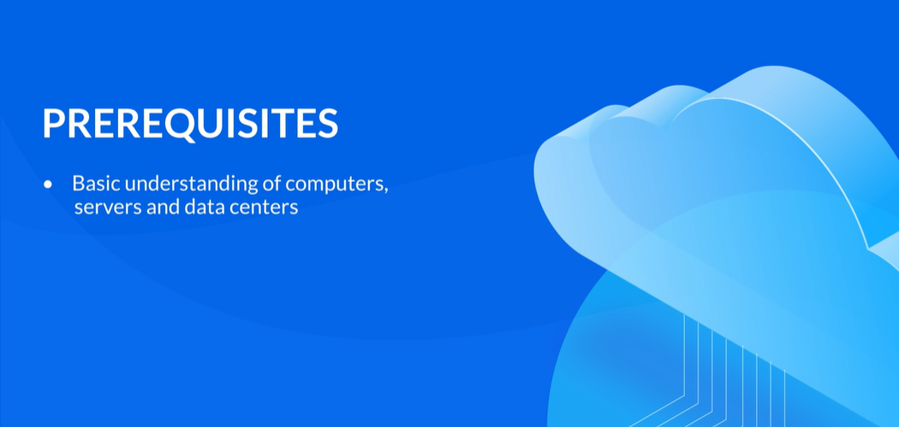

# AZ-900 Подготовка к экзамену: основы Microsoft Azure

## Основы облака — Введение

Здравствуйте и добро пожаловать в «Основы облачных вычислений»

После прохождения этого курса вы сможете ответить на следующие вопросы.
 
- Во-первых, что такое Облако? 
- Во-вторых, есть разные типы? 
- В-третьих, каковы некоторые ключевые характеристики облака? 
- В-четвертых, каковы основные облачные сервисы?

Следующие предпосылки будут полезны для этого курса. Вы должны иметь общее представление о компьютерах, серверах и центрах обработки данных. 

