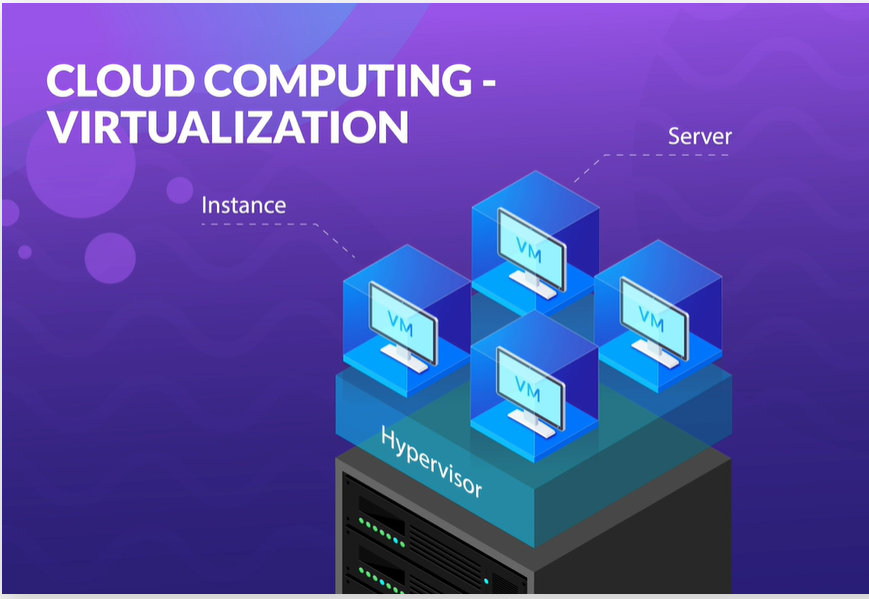
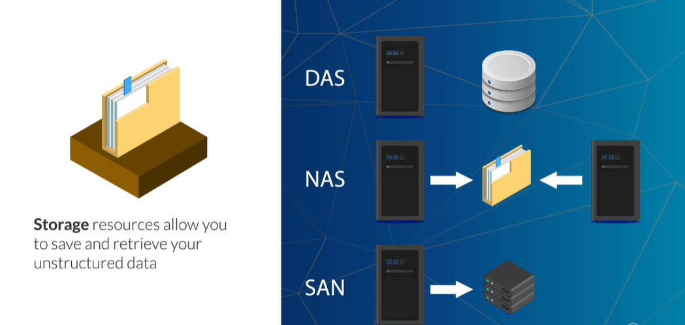
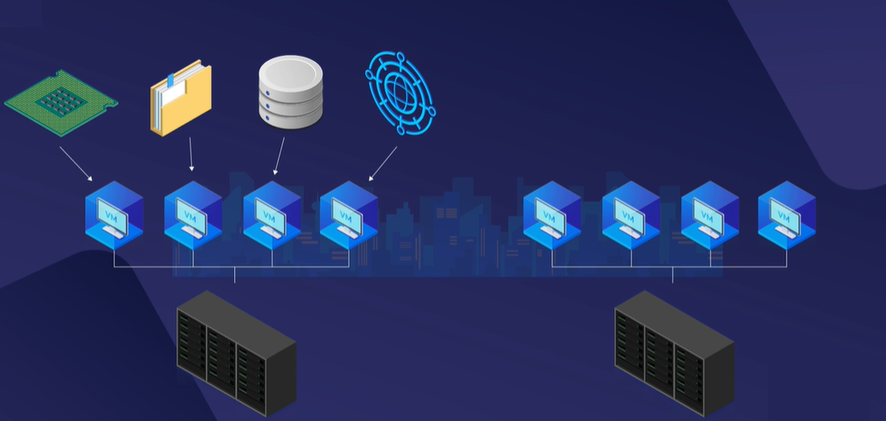

# AZ-900 Подготовка к экзамену: основы Microsoft Azure

## Облачные вычисления

Итак, что же это за «Облако», о котором вы все время слышите? Когда люди говорят об облаке, они обычно имеют в виду облачные вычисления. Облачные вычисления уже много лет активно используются в ИТ-индустрии. 

Совсем недавно он расширился на другие сектора, такие как розничная торговля и финансы. Поскольку эта технология становится все более популярной, ее часто называют просто «облаком».

Итак, если «облако» означает облачные вычисления, то что же такое облачные вычисления? Проще говоря, облачные вычисления — это удаленный виртуальный пул общих ресурсов по требованию, которые можно быстро развертывать в любом масштабе. 

Теперь, может быть, это объяснение имеет для вас смысл, а может и нет. Там может быть несколько терминов, с которыми вы не знакомы. Не волнуйся. Я собираюсь разбить их на следующие пару слайдов, после чего снова дам вам определение. И в следующий раз это должно иметь больше смысла

Прежде чем вы сможете понять, что такое облачные вычисления, вам необходимо ознакомиться с технологией, на которой они основаны, а именно с виртуализацией. Виртуализация уже давно используется в локальных центрах обработки данных, и без виртуализации облачные вычисления были бы невозможны. 

Итак, вы спросите, что такое виртуализация? Ну, по сути, это позволяет вам создавать несколько виртуальных машин или ВМ, каждая из которых работает на одном сервере. Каждая из этих ВМ имеет собственную операционную систему и набор приложений. Все виртуальные машины могут работать одновременно, совершенно независимо, не зная о существовании друг друга. Тем не менее, все они по-прежнему используют одно и то же базовое оборудование.

Такое совместное использование ресурсов является ключевым элементом понимания виртуализации и достигается с помощью так называемого гипервизора. 

Гипервизор — это часть программного обеспечения, используемая для создания виртуализированной среды. Он находится между физическим оборудованием и виртуальными машинами и создает общий пул ресурсов виртуального оборудования для доступа каждой из них. Любой запрос от виртуальной машины к оборудованию проходит через гипервизор, что обеспечивает надлежащее совместное использование аппаратных ресурсов по мере необходимости.

Теперь виртуальные машины можно называть по-разному. Иногда вы слышите термин «экземпляр», а иногда даже «сервер». Эти термины зависят от поставщика, но оба они могут означать одно и то же, что и виртуальная машина.

Преимуществ у виртуализации много, но вот основные. 

Во-первых, легко обмениваться ресурсами. Виртуализация значительно упрощает совместное использование одного и того же оборудования многими людьми. У вас может быть кто-то, работающий под Windows, и кто-то, работающий под Linux, одновременно и на одном и том же компьютере. 

Во-вторых, меньше отходов. Большинство компьютеров не работают постоянно со 100% загрузкой. Прямо сейчас ваш компьютер, вероятно, использует лишь небольшую часть своего процессора и памяти для воспроизведения этого видео. Виртуализация дает вам доступ к ранее не использовавшимся ресурсам. Таким образом, уменьшается общее количество необходимых компьютеров. 

В-третьих, снижение эксплуатационных расходов. С виртуализацией у вас будет меньше простаивающих компьютеров. А меньшее количество оборудования означает меньшее количество требуемого пространства, мощности и охлаждения. 

Номер четыре, более экологически чистый. Меньшее количество аппаратного обеспечения, которое необходимо производить, и меньшее энергопотребление означает, что виртуализация также помогает продвигать экологичные вычисления.

Таким образом, эти виртуальные машины можно использовать для создания и совместного использования различных типов ресурсов, включая вычислительные ресурсы, хранилище, базу данных и сеть. Теперь есть и другие типы, но мы будем придерживаться основных четырех для этого курса.

Вычислительные ресурсы предоставляют вычислительную мощность по запросу для выполнения ваших рабочих нагрузок. Всякий раз, когда у вас есть программа или сценарий, который нужно запустить, вычислительные ресурсы могут работать за вас. В ваших традиционных локальных центрах обработки данных они будут эквивалентны физическим серверам, к которым вы можете удаленно подключаться, устанавливать и запускать программное обеспечение на них.

Ресурсы хранилища позволяют сохранять и извлекать неструктурированные данные. Любой ресурс, который позволяет хранить в облаке такие вещи, как изображения или видео, классифицируется как ресурс хранения. В традиционном центре обработки данных у вас будет DAS или хранилище с прямым подключением, которое включает жесткие и твердотельные диски. У вас также могут быть такие вещи, как NAS или SAN, сетевое хранилище или сеть хранения данных.

Ресурсы базы данных позволяют хранить структурированные наборы данных для использования в ваших приложениях. Таким образом, эквивалент в вашем традиционном центре обработки данных будет включать такие базы данных, как SQL Server, Oracle или MySQL. 

Cетевые ресурсы, которые позволяют вам контролировать, как все остальные ресурсы будут взаимодействовать друг с другом. Теперь, в традиционном центре обработки данных, это будет включать такие вещи, как маршрутизаторы, коммутаторы, брандмауэры и балансировщики нагрузки.

В облачных вычислениях конечный пользователь может либо напрямую управлять этими ресурсами, либо управление может быть абстрагировано для создания бессерверных предложений. 

Бессерверность не означает, что в буквальном смысле нет серверов или виртуальных машин. Это просто означает, что виртуальные машины скрыты. Бессерверные предложения не требуют каких-либо знаний или взаимодействия с базовыми виртуальными машинами. 

Вместо этого вы можете использовать бессерверную службу, и она автоматически будет управлять виртуальными машинами за вас. Так, например, в бессерверной базе данных, когда вам нужно больше места для хранения или вычислительной мощности, это автоматически добавляется в фоновом режиме. Затем, когда требуется меньшая вычислительная мощность, ресурсы могут быть автоматически удалены. Таким образом, вы можете использовать бессерверную базу данных, не беспокоясь об обновлениях, обновлениях или обслуживании.

Давайте вернемся к нашему определению облачных вычислений и посмотрим, имеет ли оно больше смысла.

Облачные вычисления — это удаленный виртуальный пул общих ресурсов по требованию, которые можно быстро развертывать в любом масштабе. 

Итак, поставщик облачных услуг имеет несколько физических компьютеров в нескольких центрах обработки данных, и они разделены на виртуальные машины. Теперь эти виртуальные машины используются для создания вычислений, хранилищ, баз данных, сетей и многих других типов служб. Благодаря облачным вычислениям у вас есть возможность запрашивать и использовать столько виртуальных ресурсов, сколько необходимо. 

Когда вам нужно масштабировать вещи, чтобы удовлетворить резкое увеличение спроса, вы можете это сделать.

Здравствуйте и добро пожаловать в «Основы облачных вычислений»

После прохождения этого курса вы сможете ответить на следующие вопросы.
 
- Во-первых, что такое Облако? 
- Во-вторых, есть разные типы? 
- В-третьих, каковы некоторые ключевые характеристики облака? 
- В-четвертых, каковы основные облачные сервисы?

Следующие предпосылки будут полезны для этого курса. Вы должны иметь общее представление о компьютерах, серверах и центрах обработки данных. 

